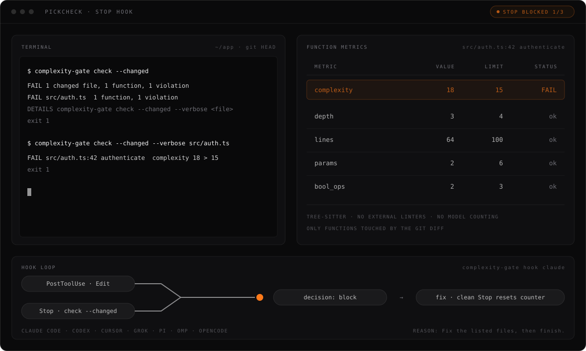

<p align="center">
  
</p>

# PickCheck

A complexity gate for coding agents. PickCheck measures every function an agent
changes with tree-sitter, for JavaScript, TypeScript, TSX, Svelte, Dart, Rust,
Python, and Go, without external linters. Its hooks block completion while a
changed function exceeds its limits, up to a configured retry cap.

Pickforge lets agents run and test apps. PickCheck checks the complexity of the
code they change.

Local-first. Open source. Built for people who ship.

PickCheck was formerly named complexity-gate. Commands, packages, and config
paths keep that name; see [Compatibility names](#compatibility-names).

## Install

Want your coding agent to handle the setup? Send it the
[AI installation guide](INSTALL_WITH_AGENT.md). It tells the agent how to choose
integrations, install hooks and plugins, update agent instructions, and verify
the result.

Install the binary, then choose the coding harness integrations you want:

```sh
npm install --global @pickforge/complexity-gate
complexity-gate-install
```

The installer supports Claude Code, Codex, Pi, OMP, Grok, Cursor, and OpenCode.
The second command prompts for a comma-separated harness list, `all`, or `none`.
Choose non-interactively with `complexity-gate-install --harness claude,codex`
or `--all`. It preserves existing configuration and can print changes first
with `--print`.

The npm package requires Node.js 22 or newer. It downloads the matching binary,
verifies its SHA-256 checksum, and installs the selected hooks or plugins.

To install only the binary, download the archive for your platform from
[GitHub Releases](https://github.com/pickforge/complexity-gate/releases), verify
its checksum, and place `complexity-gate` on `PATH`. To build from source:

```sh
cargo install --git https://github.com/pickforge/complexity-gate --package complexity-gate --locked
```

## Quickstart

```sh
complexity-gate check src                             # check a directory
complexity-gate check --changed                       # only functions touched by the Git diff
complexity-gate check --changed --verbose src/auth.ts # details for one failing file
complexity-gate check --format json .                 # machine-readable report
complexity-gate doctor --coverage                     # config chain, grammars, unclassified syntax
```

`check` exits 0 when clean, 1 for violations, and 2 for usage/runtime errors.
Unsupported extensions are reported as `UNVERIFIED` without failing.
`--changed` prints a summary capped at 20 paths and never scans outside a Git
repository with `HEAD`. Use its `DETAILS` command to inspect one failing file.
Explicit paths remain detailed by default; `--summary` makes them compact.

### Hooks

Hooks are the recommended mode. They check edited files during the turn and
block completion while changed functions exceed the limits. The npm installer
configures them automatically. Native adapters are available through
`complexity-gate hook claude|codex|cursor|grok`; Pi and OMP use their extension
API, and OpenCode uses its plugin API. A Stop is blocked at most
`hook.max_blocks` times in a row (default 3). Field mappings and limitations are
in [`docs/hooks.md`](docs/hooks.md).

<p align="center">
  
</p>

## Metrics

Each function is measured on its own. A violation is `value > limit`.

| Metric | Measures | Default limit |
|---|---|---|
| `complexity` | Cyclomatic complexity: 1 + decision points | 15 |
| `depth` | Deepest control-flow nesting | 4 |
| `lines` | Significant lines, without blanks and comments | 100 |
| `params` | Declared parameters | 6 |
| `bool_ops` | Short-circuit operators in one expression | 3 |
| `widget_depth` | Dart `build` methods: nested widget constructors | 7 |

Test files are exempt from `lines` only. Counting rules per language are in
[`docs/spec.md`](docs/spec.md).

## Compatibility names

Only the product name changed. Everything that runs keeps the complexity-gate
name, so existing installs, hooks, and configs keep working.

| Surface | Name |
|---|---|
| Repository | [`pickforge/complexity-gate`](https://github.com/pickforge/complexity-gate) |
| npm package | `@pickforge/complexity-gate` |
| Binary and installer | `complexity-gate`, `complexity-gate-install` |
| Cargo packages | `complexity-gate`, `complexity-gate-core` |
| Repo config | `.complexity-gate.json` |
| User config | `~/.config/complexity-gate/config.json` |
| Hook state | `~/.pickforge/complexity-gate/`, `COMPLEXITY_GATE_HOME` |

## Configuration

Run `complexity-gate init` to write `.complexity-gate.json`. Resolution order is
built-in defaults, user config, nearest repo config, then `--config`; later
values win. Defaults and language overrides are documented in
[`docs/spec.md`](docs/spec.md).

## Privacy

- Complexity checks run locally and do not need an external analysis service.
- The npm installer downloads the release binary from GitHub and verifies its checksum.
- Nothing is written into the checked repository, except by `init`.
- Hook loop counters live in `~/.pickforge/complexity-gate/`.
- Git runs with external diff, textconv, fsmonitor, and hooks disabled.

## Development

```sh
cargo test --workspace --locked --all-targets
cargo clippy --workspace --all-targets -- -D warnings
cargo run -- check crates
cargo llvm-cov --workspace --locked --fail-under-lines 89
```

## License

MIT — see [LICENSE](LICENSE).

---

<p align="center">
  <a href="https://pickforge.dev">
    
  </a>
</p>
